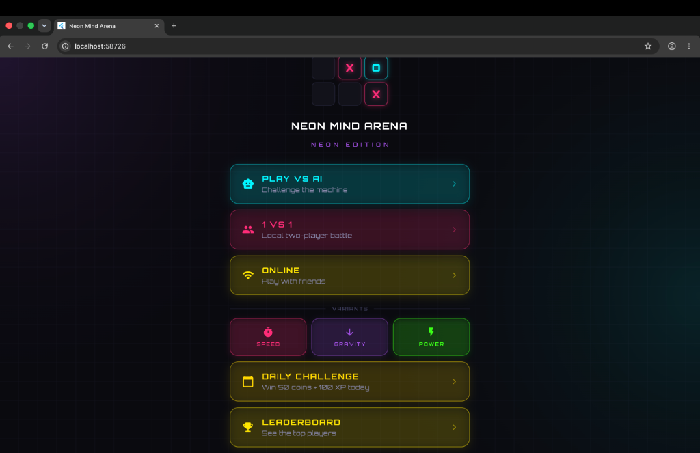
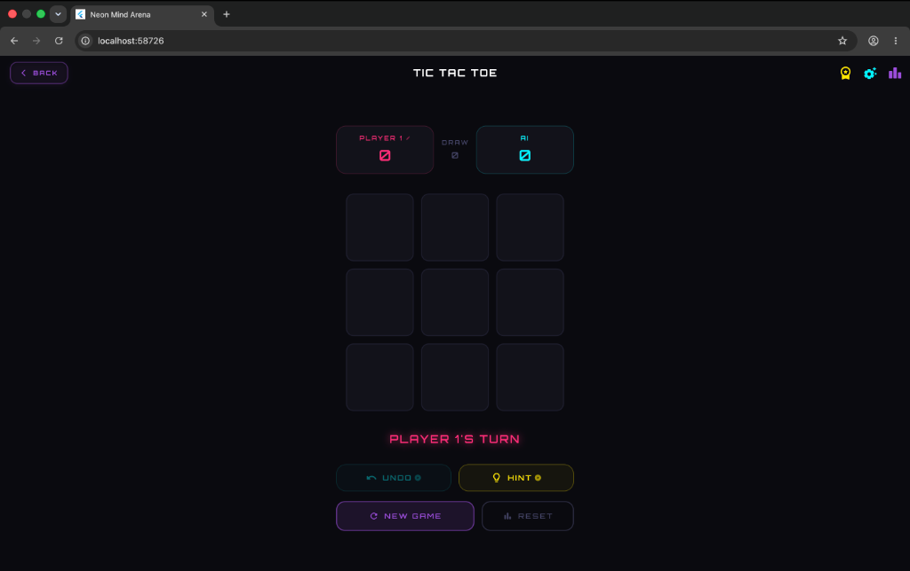
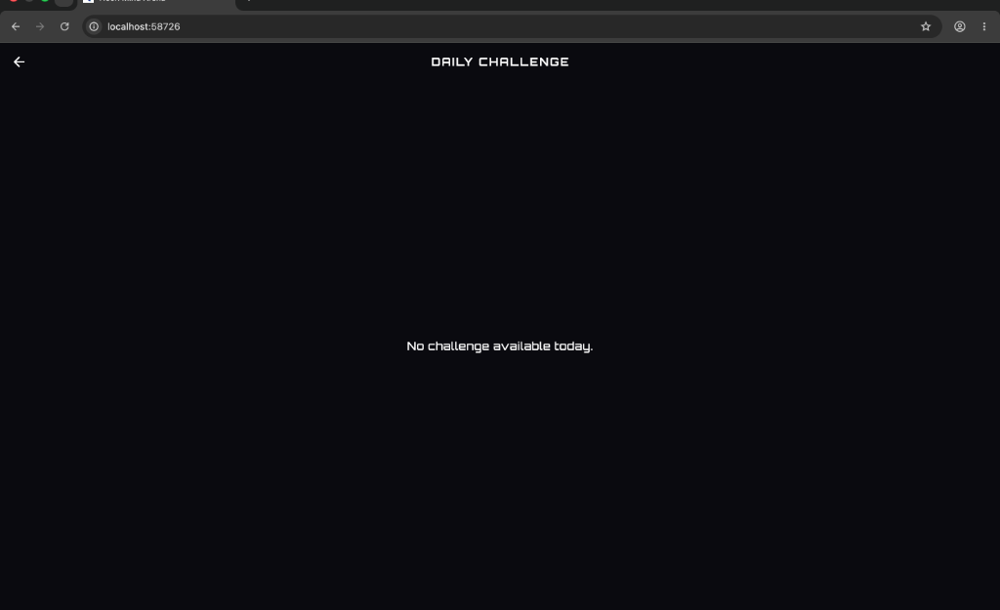

# 🌌 Neon Mind Arena (Tic Tac Toe: Neon Edition)

[](https://flutter.dev)
[](https://pub.dev/packages/go_router)
[](LICENSE)

Welcome to **Neon Mind Arena**, a premium competitive brain-game platform built with Flutter. This is not just another Tic Tac Toe game—it is a retro-futuristic cyber-arena featuring glowing neon styles, dynamic animations, multiple game variants, progression tiers, and real-time online multiplayer.

---

## 📸 Screenshots

### 1. Main Dashboard & Menu (Desktop Web / Tablet Layout)


### 2. Active Game Board (Side-by-Side Wide Layout)


### 3. Daily Challenges


---

## ⚡ Key Features

* **Dynamic Responsive Layouts:** Optimized for all screen form factors. On tablet landscape or desktop web browser windows, screens automatically adapt to a gorgeous **side-by-side (dual-column) view** to maximize horizontal real estate. On mobile, it seamlessly falls back to a portrait stacked layout.
* **Premium Web Routing & Navigation:** Fully integrated with `go_router` and Flutter's **Path URL Strategy**. The browser address bar displays clean, readable URLs (e.g. `/profile`, `/leaderboard`, `/online-lobby`) without any hash (`#`) symbols. Native browser back/forward buttons work out-of-the-box.
* **Sleek Neon Aesthetics:** Designed with custom glassmorphism panels, glowing neon outline cards, interactive scaling, haptics, and hover animations.
* **Multiple Game Modes:**
  - **Vs AI:** Play against local AI with EASY, MEDIUM, or HARD difficulties.
  - **Local 1v1:** Challenge a friend on the same screen.
  - **Online Multiplayer:** Create or Join real-time matchmaking rooms backed by Firebase.
* **Game Variants:** Try unique rule sets like **Speed Mode** (timed moves), **Gravity Mode** (pieces drop to the lowest row), and **Power-Ups**.
* **Player Progression:** Earn XP and Coins, unlock profile levels, and climb competitive **Tiers** (Bronze, Silver, Gold, Platinum, Diamond).
* **Board Summary Stats:** Keep track of total active players, total games played, and average win rates.

---

## 🛠️ Getting Started

### Prerequisites
* [Flutter SDK](https://flutter.dev/docs/get-started/install) (`^3.11.0`)
* Firebase account setup (optional, required for Online Matchmaking)

### Installation
1. Clone the repository:
   ```bash
   git clone https://github.com/diiya07/TicTacToePlay.git
   cd TicTacToePlay
   ```
2. Fetch package dependencies:
   ```bash
   flutter pub get
   ```

### Running the App
* **Mobile (iOS / Android):**
  ```bash
  flutter run
  ```
* **Web (Desktop / Chrome):**
  Using the CanvasKit renderer is recommended to get the best visual performance for custom neon shaders and grid canvas graphics:
  ```bash
  flutter run -d chrome --web-renderer canvaskit
  ```

---

## 🤝 Contribution & License
Contributions are welcome! Please feel free to open issues or submit pull requests. Licensed under the MIT License.
